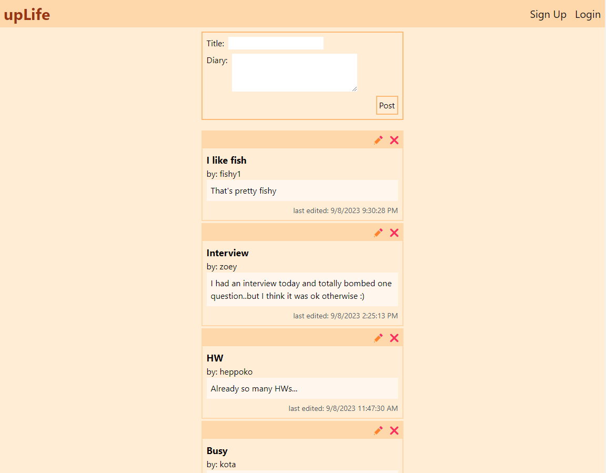

# upLife

</img>

## Table of Contents

- [What is upLife?](#desc)
- [How to Use](#how)
- [Technology Stack](#tech-stack)
- [Key Features](#key-features)

## What is upLife?

upLife is a platform where users can create and share their diary.

## How to Use

upLife is a web-based app. It is available [_here_](https://uplife.heppoko.space/).

## Technology Stack

upLife is a full-stack web application using React on the frontend, NodeJS+Express on the backend, and MongoDB as the database.

### Frontend:

- Language: Typescript
- Framework: React (Vite)
- Styling: Tailwind CSS
- Routing: React-Router
- Hosting: Netlify.com (https://uplife.heppoko.space/)

### Backend:

- Language: Javascript
- Framework: NodeJS, Express
- Security: JWT Authentication, Bcrypt
- Hosting: Render.com

### Database:

- Database: MongoDB

## Key Features

- To create a diary, a user has to sign up with a username and password, then login
- A user can view diaries created by other users, but cannot edit or delete if the diary was not created by the user.
